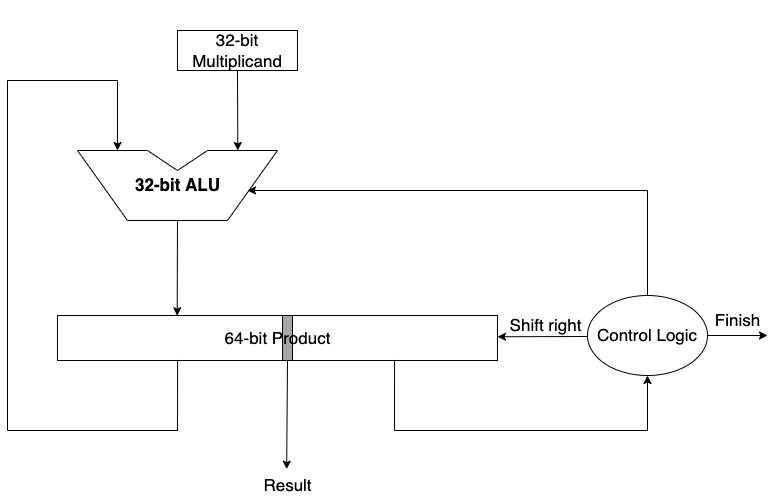

# 乘法器


## 前置知识
你需要复习理论课中提到的`multiplier V3`，即



其基本含义以及具体流程在理论课中已经进行过详细讲解，本文档不再重复这部分内容，而只对实验需要注意的部分进行提醒。如果你对这个过程还有疑惑，可以自行搜索 ***Russian Peasant Multiplication***，这可能有助于你理解乘法器的实现。

在这一实现中，我们需要32次“循环”来完成一次32位乘法，并得到一个64位的结果。

**开始时将“乘数”放在 Product 的低32位**：关注到每一次循环我们都需要对“乘数”进行一次右移操作，同时每一次循环我们都对 Product 进行一次右移且低32位不参与加法计算。

我们需要一个控制逻辑来判断参与加法的是**0**还是**被乘数**，同时需要判断何时停止运算。运算结束的条件很简单，即完成了32次循环，只需要一个计数器即可实现。在我们的算法中，如果乘数的***最低位***是1则给 Product 的高32位加一个被乘数；否则，不需要改变 Product 的值。

## 模块实现
你的模块端口应为：

<div style="display:none">5LiN5oOz5YaZ5a6e6aqM5oyH5a+85ZWK5ZWK5ZWK5ZWK5ZWK5ZWK5ZWK5ZWK5ZWK77yM6L+ZIHRtZCDlhpnlh7rmnaXkuZ/kuI3mmK/kurror53llYo=</div>

```verilog title="multiplier.v"
module multiplier(
  input           clk,      // 时钟信号
//input           start     // 开始运算，不要求实现这个端口
  input [31:0]    A,        // 两个 32-bit 输入值
  input [31:0]    B,
  output          finish,   // 当结束计算时置1，你可能需要将它改为 `output reg`
  output[63:0]    res       // 64-bit 输出，你可能需要将它修改为 `output reg[63:0]`
)
```

