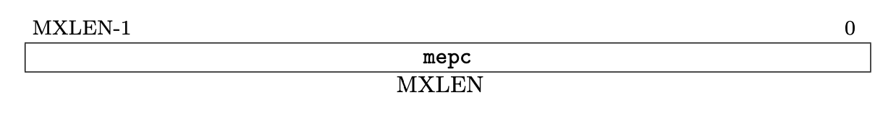

# Lab4-4

!!! danger "本实验并未 release，内容随时都会变化。个人水平有限，如您发现文档中的疏漏欢迎 Issue！"

## 前置知识

### Exception and Interruption

在 [Volume I: RISC-V Unprivileged ISA V20191213](./attachment/riscv-spec-20191213.pdf) 第 1.6 节，有对 exception 和 interruption 的解释：

> We use the term ***exception*** to refer to an unusual condition occurring at run time **associated with
an instruction** in the current RISC-V hart. We use the term ***interrupt*** to refer to an **external
asynchronous event** that may cause a RISC-V hart to experience an unexpected transfer of control.
We use the term ***trap*** to refer to **the transfer** of control to a trap handler caused by either an
exception or an interrupt.

为了方便文档描述，下文中我们用“中断”指代 *interruption*，用“异常”指代 *exception*，用 *trap* 表示中断与异常。

### Control and Status Registers(CSRs)

在 32 个通用寄存器之外（即 `x0 - x31`），还有若干*控制状态寄存器*(Control and Status Register, CSR)。在我们的实验中，CPU 始终运行在 Machine Mode 下，在本实验中我们只需要关注 Machine Mode 下的部分 CSR。

对于每个 CSR 的详细介绍，请查看 [Volume II: RISC-V Privileged Architectures V20211203](./attachment/riscv-privileged-20211203.pdf)，这里仅对我们本次实验需要用到的 CSRs 进行简介：


* **mstatus**： Machine Status Register，存储当前控制状态。
    * 
    * 本次实验中你可以做相对简化，只要可以保证在中断处理过程中不会触发新的中断即可。
* **mtvec**： Machine Trap-Vector Base-Address Register，存储中断向量表基地址。
    * 
    * 低两位记录跳转模式，`0` 为 Direct 模式，即所有 trap 都先进入 `BASE`；`1` 为 Vectored 模式，将进入 `BASE + 4*cause`。高位记录的是 `BASE` 的值（请注意对齐，`BASE << 2` 才是真正要跳转的地址）。
    * 本次实验中，你可以从以上两种模式中自由选择，这将决定你如何书写 trap 处理代码。
* **mcause**： Machine Cause Register，存储引起这次 trap 的原因。
    * 
    * 如果进入 trap 的原因是中断，则最高位 interrupt bit 设置为 1。
    * 本次实验允许你自由的设计 Exception Code 的含义，在实验报告中说明即可。
* **mtval**： Machine Trap Value Register，存储异常的相关信息以帮助软件处理异常，曾称 mbadaddr。
    * 
    * 在本次实验中没有用到，可以不进行实现，除非你希望完成存储器访问异常（本节实验的 **bonus** 内容）。
* **mepc**： Machine Exception Program Counter，存储 trap 触发时将要执行的指令地址，在 `mret` 时作为返回地址。
    * 
    * 本次实验不涉及 PC 非对齐异常，因此不需要考虑将跳转指令的目标地址送入 `mepc` 的情况。
    * 需要注意的是，在一般的实现中，你需要在 trap 处理程序中检查 `mcause` 寄存器，如果是异常则更新 `mepc <- mepc + 4`，这部分不是你的硬件实现，而是由软件（你的 trap 处理程序）进行管理的。**但是**，本次实验并不要求实现 `csrw` 等指令，因此我们要在 `RV_INT` 模块中直接管理 `mepc`，即触发 trap 时直接根据触发信号（是不是 `INT`）来决定 `mepc <- pc` 还是 `mepc <- pc+4`。

### trap

进入 trap 时，硬件需要负责修改若干 CSR 并将 PC 调整为 trap 处理程序的第一条指令位置（保存在 `mtvec` 中）。

* 更新 `mcause`，记录当前是不是中断，并记录 exception-code。
* 更新 `mstatus`，防止在 trap 处理时又触发中断。
* 更新 `mepc`，记录当前指令的地址。再次提醒，本实验中硬件 `RV_INT` 模块将直接管理 `mepc` 是否自增，如果触发的原因是中断，则 `mepc <- pc`，否则 `mepc <- pc+4`。

## 模块实现

本实验需要修改硬件（添加 `RV_INT` 模块，修改 Datapath）以及软件（修改验收代码，实现 trap 处理）。本节主要是 `RV_INT` 模块的简介。

中断处理主要是改变了**指令流**，由正常的指令运行切换到 trap 处理程序的执行，最终回到正常的指令流中继续执行。为此，我们需要设计一个模块，用来接收控制信号或外部信号，判断下一条要执行的指令是正常指令流运行还是 trap 处理的指令；同时，还需要修改 Datapath 以支持 PC 来源的改变。

```verilog title="RV_INT.v" linenums="1"
module RV_INT(
  input       clk,
  input       rst,
  input       INT,          // 外部中断信号
  input       ecall,        // ECALL 指令
  input       mret,         // MRET 指令
  input       illegal_inst, // 非法指令信号
  input [31:0] pc_next,     // 正常指令流
  output[31:0] pc           // 将执行的指令 PC 值
);
```

这一模块中，你需要保存并管理 `mstatus, mtvec, mcause, mtval, mepc` 等 CSRs。实现模块时，需要时刻注意：

* 如果正在进行 trap 处理程序（还未执行 `mret`），不接受其他 trap。
* 根据不同的中断信号，对 CSRs 进行修改，再次提醒，我们的简单实现中，需要硬件对 `mepc` 的具体取值进行管理。
* 请注意设置 CSRs 的初始值，并注意 `rst` 时恢复初始值。